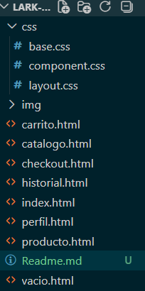

# Lark Shop E-commerce
### _Nombre del proyecto_ 🚀

### _Versión entregada:_

#### ✅ Descripcion del proyecto:
Este proyecto fue realizado con las tecnologías HTML y CSS en el cual se hizo una representación visual de una tienda virtual, solo como mockup, y posteriormente a la formación de campuslands, se le podrá dar vida usando Js y demás

## 👾 *Como ver el proyecto*
1. Crear un directorio
2. Clonar el repositorio con el siguiente comando:
```bash
git clone https://github.com/Anderson-Oloroso/Lark-Shop.git
```
3. Abrir con el navegador el archivo index.html

## 👾 *Archivos del proyecto*



## 💻 *Tecnologías utilizadas*
- HTML5
- CSS3

## 👤 _Creador_
#### *Nombre:* <u>Henrik Anderson Oloroso García</u>
##### *Ultima modificación:* <u>15/04/2025</u> 
